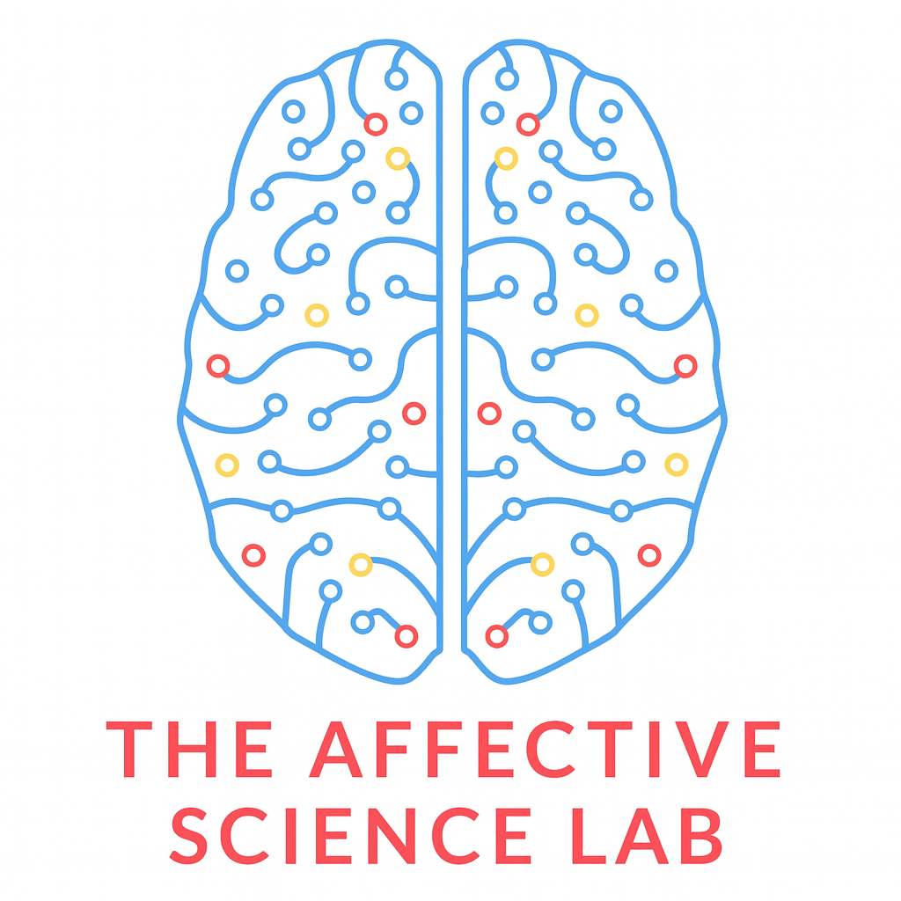
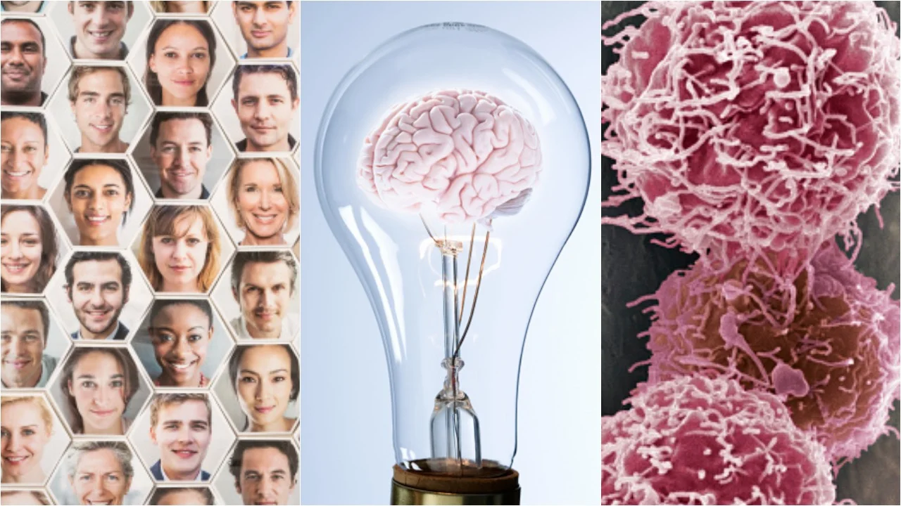

I welcome inquiries about research collaborations, invited talks, and student mentorship.

### Email

<a href="mailto:feldman.380@osu.edu" class="contact-item"> <i class="bi bi-envelope"></i> feldman.380[at]osu.edu </a>

### Offices

```{=html}
<div class="card mb-4">
  <div class="card-body d-flex align-items-start">
    
    <!-- Left: Lab logo -->
    
    
    <!-- Right: Card text -->
    <div>
      <h4 class="card-title">The Affective Science Lab</h4>
      <h6 class="card-subtitle mb-2 text-muted">Department of Psychology</h6>
      <p class="card-text">
        121 A, E, H Lazenby Hall<br>
        The Ohio State University<br>
        1827 Neil Ave, Columbus, OH 43210
      </p>
      <a href="https://affectivesciencelab.com/contact" class="card-link">Contact us!</a>
    </div>
    
  </div>
</div>

<div class="card mb-4">
  <div class="card-body d-flex align-items-start">
    
    <div>
      <h4 class="card-title">The Social Neuroscience and Health Lab</h4>
      <h6 class="card-subtitle mb-2 text-muted">Department of Psychology</h6>
      <p class="card-text">
        10A Howell Hall<br>
        The University of North Carolina at Chapel Hill<br>
        235 E. Cameron Ave, Chapel Hill, NC 27599
      </p>
      <a href="https://carolinasnhlab.com/contact" class="card-link">Contact us!</a>
    </div>
  </div>
</div>

```

### Follow me

- <i class="bi bi-bluesky me-1"></i> [BlueSky](https://bsky.app/profile/malloryjfeldman.bsky.social)
- <i class="bi bi-linkedin me-1"></i> [LinkedIn](https://www.linkedin.com/in/malloryjfeldman/)
- <i class="bi bi-google me-1"></i> [Google Scholar](https://scholar.google.com/scholar?as_sdt=0%2C14&btnG=&hl=en&q=Mallory%20Feldman)
- <i class="bi bi-info-circle-fill me-1"></i> [ORCID](https://orcid.org/0000-0003-1051-2088)
- <i class="bi bi-openai"></i> [Open Science Framework](https://osf.io/m324r/)
- <i class="bi bi-r-square-fill"></i> [ResearchGate](https://www.researchgate.net/profile/Mallory-Feldman/publications)
- <i class="bi bi-github"></i> [GitHub](https://github.com/MalloryJfeldman)
