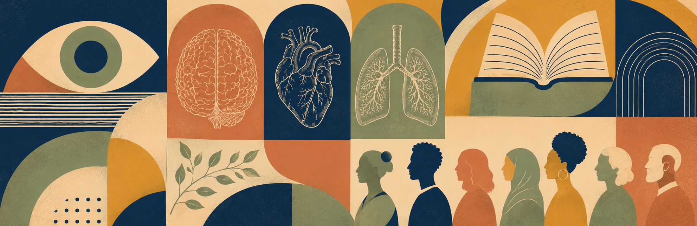

```{=html}
<style>
/* This page shows its own title overlaid on the banner below, so hide
   Quarto's auto-generated title block instead of showing it twice. */
#title-block-header { display: none !important; }
main#quarto-document-content { padding-top: 0 !important; margin-top: 0 !important; }
</style>
```

<div class="pub-banner column-screen">

<div class="pub-banner-title">Publications</div>
</div>

This page lists all my published works, organized by year. Click a paper’s title to visit the publisher page. Use `Abstract` to reveal the summary, and `Citation` for the APA 7th-edition reference.<span style="font-size:0.9rem; opacity:0.8;">* = co-first authorship</span> 

Code adapted from [Jeffrey Girard](https://affcom.ku.edu/research.html).

```{r}
# =========================================
# LOAD LIBRARIES
# =========================================
library(tidyverse)
library(RefManageR)
library(htmltools)

# =========================================
# HELPER FUNCTIONS
# =========================================
`%||%` <- function(a,b) if(is.null(a)||length(a)==0) b else a
nz_chr <- function(x) ifelse(is.na(x)|trimws(x)=="",NA_character_,x)
strip_braces <- function(x){if(is.null(x)||length(x)==0) return(NA_character_); gsub("[{}]","",as.character(x),perl=TRUE)}

fmt_authors_card <- function(entry){
  au <- entry$author
  if(is.null(au)||length(au)==0) return(NA_character_)
  fmt_one <- function(a){fam_vec <- a$family; if(length(fam_vec)) paste(as.character(fam_vec),collapse=" ") else ""}
  pieces <- vapply(au, fmt_one, character(1))
  pieces <- pieces[nzchar(pieces)]
  if(!length(pieces)) return(NA_character_)
  if(length(pieces)==1) pieces else paste(paste(pieces[-length(pieces)],collapse=", "), "&", pieces[length(pieces)])
}

get_abstract <- function(entry){abs <- entry$abstract %||% entry$annotation %||% NA_character_; if(isTRUE(is.na(abs))||!nzchar(abs)) NA_character_ else abs}

normalize_link <- function(x){
  y <- as.character(x); y[is.na(y)] <- NA_character_; y <- trimws(y)
  y[y==""|tolower(y)=="na"] <- NA_character_
  ok <- !is.na(y)
  doi_pref <- ok & grepl("^doi:\\s*",y,ignore.case=TRUE); y[doi_pref] <- sub("^doi:\\s*","",y[doi_pref],ignore.case=TRUE)
  bare_doi <- ok & grepl("^10\\.",y); y[bare_doi] <- paste0("https://doi.org/",y[bare_doi])
  domain_like <- ok & grepl("^(www\\.|[A-Za-z0-9.-]+\\.[A-Za-z]{2,})(/|$)",y)
  no_scheme <- ok & !grepl("^https?://",y,ignore.case=TRUE)
  needs_scheme <- domain_like & no_scheme; y[needs_scheme] <- paste0("https://",y[needs_scheme])
  y
}

# =========================================
# READ BIB FILE AND PREP DATA FRAME
# =========================================
bib <- ReadBib("publications/papers.bib",check=FALSE) #update
keys <- names(bib)
rows <- tibble(key=keys, entry=lapply(keys, function(k) bib[k])) |>
  mutate(
    title = map_chr(entry, ~strip_braces(.x$title%||%"")),
    authors_card = map_chr(entry, fmt_authors_card),
    year = map_chr(entry, ~{y<-.x$year%||%.x$date%||%""; if(is.list(y)) y$year%||%"" else as.character(y)}),
    venue = map_chr(entry, ~strip_braces(.x$journal%||%.x$booktitle%||%.x$publisher%||%"")),
    abstract = map_chr(entry, get_abstract),
    keywords = map(entry, ~{kw <- .x$keywords%||%NA_character_; if(is.na(kw)||length(kw)==0) character(0) else strsplit(as.character(kw),",\\s*")[[1]]}),
    doi_url = map_chr(entry, ~normalize_link(.x$doi%||%.x$url%||%NA_character_)),
    pdf_url = map_chr(entry, ~{f <- .x$file%||%NA_character_; if(!is.na(f)&&length(f)>0) as.character(f[[1]]) else NA_character_})
  ) |>
  arrange(desc(year), title)

# =========================================
# BUILD KEYWORD DROPDOWN
# =========================================
all_keywords <- rows %>% pull(keywords) %>% unlist() %>% unique() %>% sort()
keyword_dropdown <- tags$div(
  id="keyword-filter-bar", style="margin-bottom:18px;",
  tags$label(`for`="keyword-select", style="font-size:0.95rem; margin-right:8px; color:#555;", "Filter by topic:"),
  tags$select(
    id="keyword-select",
    style="font-size:0.95rem; padding:5px 10px; border:1px solid #ddd; border-radius:8px; background:#fafafa; cursor:pointer;",
    tags$option(value="ALL", "All topics"),
    lapply(all_keywords, function(kw) tags$option(value=kw, kw))
  ),
  tags$span(id="kw-count", style="margin-left:12px; font-size:0.88rem; color:#888;")
)
```

```{=html}
<!-- KEYWORD FILTER SCRIPT -->
<script>
document.addEventListener("DOMContentLoaded",function(){
  const select=document.getElementById('keyword-select');
  const countEl=document.getElementById('kw-count');
  const cards=Array.from(document.querySelectorAll('.pub-card'));
  const yearGroups=Array.from(document.querySelectorAll('.year-group'));

  function updateCount(visible){
    countEl.textContent = visible < cards.length ? visible + " of " + cards.length + " papers" : "";
  }

  function applyFilter(){
    const kw=select.value;
    let visible=0;
    cards.forEach(card=>{
      const match=(kw==="ALL")||(card.getAttribute('data-keywords')||"").split("||").includes(kw);
      card.style.display=match?"block":"none";
      if(match) visible++;
    });
    // Hide year headings that have no visible cards
    yearGroups.forEach(group=>{
      const anyVisible=Array.from(group.querySelectorAll('.pub-card')).some(c=>c.style.display!=="none");
      group.style.display=anyVisible?"block":"none";
    });
    updateCount(visible);
  }

  select.addEventListener('change', applyFilter);
  updateCount(cards.length);
});
</script>

<script>
document.addEventListener("DOMContentLoaded", function() {

  // Handle Abstract / Citation toggle
  document.querySelectorAll('.pub-card').forEach(card => {

    const panel = card.querySelector('.toggle-area');
    const content = panel.querySelector('.content');
    const label = panel.querySelector('.panel-label');
    const abstractPayload = card.querySelector('.payload-abstract')?.innerHTML || "";

    card.querySelectorAll('[data-action]').forEach(btn => {

      btn.addEventListener('click', function(e) {
        e.preventDefault();

        const action = this.getAttribute('data-action');
        const current = panel.getAttribute('data-current');

        // If clicking same thing twice → close panel
        if (current === action) {
          panel.style.display = "none";
          panel.setAttribute('data-current', "");
          return;
        }

        // Otherwise open and populate
        panel.style.display = "block";
        panel.setAttribute('data-current', action);

        if (action === "abstract") {
          label.textContent = "Abstract";
          content.innerHTML = abstractPayload || "<em>No abstract available.</em>";
        }

        if (action === "citation") {
          label.textContent = "Citation";
          content.innerHTML = "Rendering citation…";
          
          // Grab formatted citation from Quarto refs
          const key = card.getAttribute('data-key');
          const ref = document.querySelector(`#ref-${key}`);
          content.innerHTML = ref ? ref.innerHTML : "<em>Citation not found.</em>";
        }
      });

    });

    // Copy button
    const copyBtn = panel.querySelector('.copy-btn');
    const toast = panel.querySelector('.copy-toast');

    copyBtn.addEventListener('click', function() {
      const text = content.innerText;
      navigator.clipboard.writeText(text).then(() => {
        toast.style.display = "inline";
        setTimeout(() => toast.style.display = "none", 1200);
      });
    });

  });

});
</script>

```

```{css}
/* =========================================
   PUBLICATION LIST -- matches the "Most recent
   publications" row style on the homepage:
   no card boxes, thin dividers between entries,
   bold navy titles, burnt-orange year headers.
========================================= */
body { background: var(--brand-paper); }

.pub-banner {
  position: relative;
  overflow: hidden;
  margin: 0 0 2.5rem;
}
.pub-banner img {
  width: 100% !important;
  height: auto !important;
  max-width: none !important;
  display: block;
}
.pub-banner-title {
  position: absolute;
  top: 50%;
  left: 50%;
  transform: translate(-50%, -50%);
  width: min(90%, 640px);
  text-align: center;
  background: rgba(45, 60, 89, 0.6);
  color: #fff;
  font-family: var(--brand-font-body);
  font-weight: 700;
  letter-spacing: 0.1em;
  text-transform: uppercase;
  font-size: clamp(1.1rem, 3vw, 1.8rem);
  padding: 0.75rem 1.5rem;
}

#keyword-filter-bar { margin-bottom: 1.5rem; }
#keyword-filter-bar label {
  font-family: var(--brand-font-body);
  font-weight: 600;
  color: var(--brand-ink);
}
#keyword-filter-bar select {
  font-family: var(--brand-font-body);
  border: 1px solid var(--brand-line);
  border-radius: 4px;
  background: var(--brand-paper);
  color: var(--brand-ink);
}
#kw-count { color: var(--brand-ink-soft); }

.year-group { margin: 2.5rem 0 0.5rem; }
.year-group:first-child { margin-top: 1rem; }
.year-title {
  font-family: var(--brand-font-display);
  font-weight: 600;
  font-size: 1.4rem;
  color: var(--brand-terracotta-deep);
  margin: 0 0 0.25rem;
  border-bottom: none !important;
  padding-bottom: 0 !important;
}

.pub-card {
  border: none;
  border-radius: 0;
  border-top: 1px solid var(--brand-line);
  padding: 1.35rem 0;
  margin: 0;
  background: transparent;
}
.year-group .pub-card:first-of-type { border-top: none; padding-top: 0.5rem; }

.pub-card-title {
  display: block;
  font-family: var(--brand-font-body);
  font-weight: 700;
  font-size: 1.05rem;
  color: var(--brand-navy);
  margin: 0 0 6px;
  line-height: 1.4;
}
.pub-card-title a {
  color: inherit;
  text-decoration: none;
  border-bottom: 1px solid transparent;
}
.pub-card-title a:hover,
.pub-card-title a:focus-visible {
  border-bottom-color: var(--brand-terracotta-deep);
}
.pub-card-meta {
  font-family: var(--brand-font-body);
  color: var(--brand-ink-soft);
  font-size: 0.9rem;
  margin: 0 0 10px;
  line-height: 1.6;
}
.pub-card-meta em { font-style: italic; }
.pub-card-actions {
  display: flex;
  flex-wrap: wrap;
  gap: 8px 18px;
  margin-top: 4px;
  margin-bottom: 4px;
}
.pub-card-actions a {
  font-family: var(--brand-font-body);
  font-weight: 600;
  text-decoration: none;
  font-size: 0.8rem;
  letter-spacing: 0.02em;
  text-transform: uppercase;
  border-bottom: 1px dotted var(--brand-terracotta-deep);
  color: var(--brand-navy);
  cursor: pointer;
}
.pub-card-actions a.external { border-bottom-style: solid; }
.pub-card-actions a:hover,
.pub-card-actions a:focus-visible { color: var(--brand-terracotta-deep); }

.toggle-area {
  display: none;
  position: relative;
  border: 1px solid var(--brand-line);
  border-radius: 6px;
  padding: 14px 48px 14px 16px;
  background: var(--brand-paper);
  margin-top: 10px;
  margin-bottom: 6px;
  overflow: auto;
  font-family: var(--brand-font-body);
  color: var(--brand-ink-soft);
  font-size: 0.92rem;
  line-height: 1.65;
}
.toggle-area .panel-label {
  font-size: 0.75rem;
  color: var(--brand-terracotta-deep);
  font-weight: 700;
  text-transform: uppercase;
  letter-spacing: 0.06em;
  margin-bottom: 8px;
}
.copy-btn {
  position: absolute;
  top: 10px;
  right: 10px;
  border: 1px solid var(--brand-line);
  background: var(--brand-paper);
  font-family: var(--brand-font-body);
  font-size: 0.8rem;
  padding: 4px 10px;
  border-radius: 4px;
  cursor: pointer;
  color: var(--brand-navy);
}
.copy-btn:hover { border-color: var(--brand-terracotta-deep); }
.copy-toast {
  position: absolute;
  top: 12px;
  right: 90px;
  font-family: var(--brand-font-body);
  font-size: 0.78rem;
  background: var(--brand-navy);
  color: #fff;
  padding: 3px 8px;
  border-radius: 4px;
  display: none;
}
#quarto-appendix{display:none !important;}

@media(max-width:768px){
  .pub-card{padding:1.1rem 0;}
}
```

```{r}
# =========================================
# BUILD PUBLICATION CARDS
# =========================================
build_card <- function(key, entry, title, authors_card, year, venue, abstract, doi_url=NA_character_, pdf_url=NA_character_, keywords=character()){
  payloads <- tags$div(style="display:none;", tags$div(class="payload-abstract",abstract%||%""))
  ttl_node <- if(isTRUE(nzchar(doi_url%||%""))) tags$div(class="pub-card-title", tags$a(title, href=doi_url, target="_blank", rel="noopener")) else tags$div(class="pub-card-title",title)
  meta <- tags$div(class="pub-card-meta", if(nzchar(authors_card%||%"")) tagList(HTML(authors_card),tags$br()) else NULL, if(nzchar(venue%||%"")) tags$em(venue) else NULL)
  actions <- tags$div(class="pub-card-actions", tags$a("Abstract", href="#", `data-action`="abstract", role="button"), tags$a("Citation", href="#", `data-action`="citation", role="button"), if(!is.na(pdf_url)&&nzchar(pdf_url)) tags$a("[PDF]", href=pdf_url, target="_blank", rel="noopener", class="external"))
  toggle_panel <- tags$div(class="toggle-area", `data-current`="", tags$button(class="copy-btn","Copy"), tags$span(class="copy-toast","Copied!"), tags$div(class="panel-label","—"), tags$div(class="content"))
  tags$div(class="pub-card", `data-key`=key, `data-keywords`=paste0(keywords,collapse="||"), ttl_node, meta, actions, toggle_panel, payloads)
}

years <- rows |> distinct(year) |> arrange(desc(year)) |> pull(year)
groups <- lapply(years,function(y){
  subset <- rows |> filter(year==y)
  subset_min <- subset |> select(key,entry,title,authors_card,year,keywords,venue,abstract,doi_url,pdf_url)
  cards <- pmap(subset_min, build_card)
  tags$div(class="year-group", tags$h2(class="year-title anchored", id=paste0("y-",y), str_to_title(y)), tags$div(cards))
})

browsable(tags$div(keyword_dropdown, tags$div(groups)))

```

::: {style="margin-top:1rem;"}
## In Preparation & Under Review {style="font-family:var(--brand-font-display); font-weight:600; font-size:1.6rem; color:var(--brand-navy); border-top:1px solid var(--brand-line); padding-top:2.5rem; margin-bottom:0.25rem;"}

<p style="color:var(--brand-ink-soft); font-size:0.95rem; margin:0 0 0.5rem;">The manuscripts below have not yet completed peer review.</p>
:::

<div class="year-group">
<h3 class="year-title">Under Review</h3>
<div class="pub-card">
<div class="pub-card-title">Bodies, behaviors, and situations: A representational similarity analysis of emotion concept knowledge and its links to emotional granularity.</div>
<div class="pub-card-meta">Feldman, M. J., MacCormack, J. K., &amp; Lindquist, K. A.<br><em>Under review at</em> <em>Emotion</em></div>
</div>
<div class="pub-card">
<div class="pub-card-title">Social connection predicts higher emotional clarity: Evidence from an experience sampling study.</div>
<div class="pub-card-meta">Feldman, M. J., Luo, J., Steele, C., Bonar, A., Tuck, A., Thompson, R., Lindquist, K., &amp; Inagaki, T.<br><em>Under review at</em> <em>Affective Science</em></div>
</div>
<div class="pub-card">
<div class="pub-card-title">Testing dyadic similarity in social networks: A multiple membership modeling approach.</div>
<div class="pub-card-meta">Feldman, M. J., Steinley, D., &amp; Bauer, D. J.<br><em>Under revision at</em> <em>Behavior Research Methods</em></div>
</div>
<div class="pub-card">
<div class="pub-card-title">Ups and downs of blood pressure-related social algesia: A daily sampling study.</div>
<div class="pub-card-meta">Inagaki, T. K., Steele, C. M., DeCataldo, M. K., Dembling, S. J., Bonar, A. S., Feldman, M. J., MacCormack, K. A., &amp; Ginaros, P. J.<br><em>Under review at</em> <em>Journal of Physiological Anthropology</em></div>
</div>
<div class="pub-card">
<div class="pub-card-title">Does inflammation influence responses to unfair treatment?</div>
<div class="pub-card-meta">Cardenas, M. N., Feldman, M. J., Antenucci, N. M., West, T. N., Jolink, T., Nakamura, Z. M., &amp; Muscatell, K. A.<br><em>Under review at</em> <em>Journal of Experimental Social Psychology</em></div>
</div>
<div class="pub-card">
<div class="pub-card-title">Interoceptive accuracy, metacognition, and interpersonal trust perception across the adult lifespan.</div>
<div class="pub-card-meta">Ma, R., Feldman, M. J., Bonar, A. S., Frye, N. G., Imamoglu, A., Giovanello, K. S., &amp; Lindquist, K. A.<br><em>Under revision at</em> <em>Affective Science</em></div>
</div>
<div class="pub-card">
<div class="pub-card-title">Immune activity selectively disrupts interpersonal coordination during social interactions.</div>
<div class="pub-card-meta">West, T. N., Jolink, T., Feldman, M. J., Antenucci, N. M., Cardenas, M. N., Nakamura, Z. M., Fredrickson, B. L., &amp; Muscatell, K. A.<br><em>Under review at</em> <em>Journal of Experimental Psychology: General</em></div>
</div>
<div class="pub-card">
<div class="pub-card-title">Perceived neighborhood disadvantage predicts similarity in amygdala representations of negative and neutral images in early adolescents.</div>
<div class="pub-card-meta">Bonar, A. S., Dai, J., Feldman, M. J., Capella, J., Prinstein, M. J., Telzer, E. H., &amp; Lindquist, K. A.<br><em>Under revision at</em> <em>Developmental Science</em></div>
</div>
<div class="pub-card">
<div class="pub-card-title">Friendship dynamics and neural sensitivity to threats and rewards: Interactive impacts on adolescent loneliness.</div>
<div class="pub-card-meta">Capella, J., Jorgensen, N., Feldman, M., Bonar, A., Field, N., Prinstein, M., Lindquist, K., &amp; Telzer, E. H.<br><em>Under review at</em> <em>Developmental Psychology</em></div>
</div>
</div>

<div class="year-group">
<h3 class="year-title">In Preparation</h3>
<div class="pub-card">
<div class="pub-card-title">The structure of affect and its relationship to interoceptive attention across the adult lifespan: An experience sampling study.</div>
<div class="pub-card-meta">Feldman, M. J., Bonar, A. B., Escelante, Y., Gu, Y., Luo, J., Ma, R., Whitacre, K., Wulfekuhle, G., &amp; Lindquist, K. A.<br><em>Manuscript in preparation</em></div>
</div>
<div class="pub-card">
<div class="pub-card-title">Probing the influence of interoceptive traits and bodily states on the use of incidental affect during social judgment.</div>
<div class="pub-card-meta">Feldman, M. J., Bonar, A. B., Berman, C. J., Celeman, D., &amp; Lindquist, K. A.<br><em>Manuscript in preparation</em></div>
</div>
<div class="pub-card">
<div class="pub-card-title">Interoception predicts the neural representation of self and other in adolescence.</div>
<div class="pub-card-meta">Luo, J., Ma, R., Feldman, M. J., Flannery, J. S., Telzer, E. H., &amp; Lindquist, K. A.<br><em>Manuscript in preparation</em></div>
</div>
</div>

```{=html}
<script>
document.addEventListener("DOMContentLoaded", function() {
  document.querySelectorAll('a[href^="http"]').forEach(function(link) {
    if (!link.hostname.includes(window.location.hostname)) {
      link.setAttribute("target", "_blank");
      link.setAttribute("rel", "noopener");
    }
  });
});
</script>
```